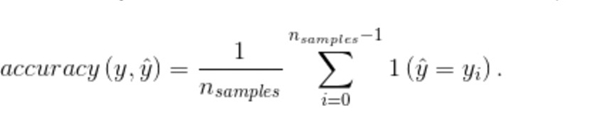
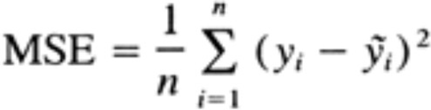
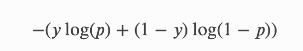
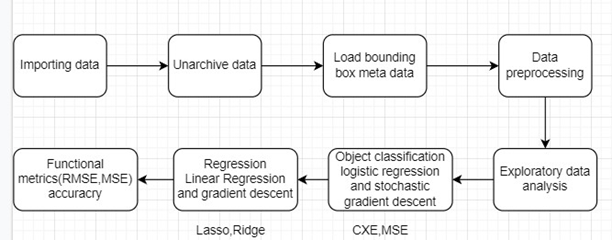
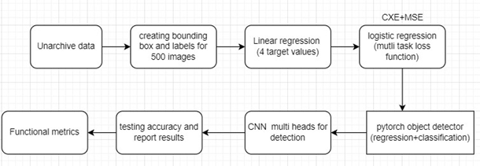
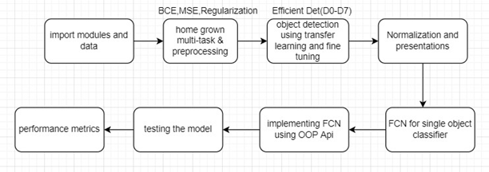

<!-- toc -->

## Table of contents

-   [Cats and Dogs Object Detection (CaDoD)](#cats-and-dogs-object-detection-cadod)
-   [Project Abstract](#project-abstract)
    -   [Data Description & Analysis](#data-description--analysis)
    -   [Training Data](#training-data)
    -   [Test Data](#test-data)
    -   [Data preprocessing](#data-preprocessing)
-   [Machine algorithms and metrics](#machine-algorithms-and-metrics)
    -   [Basic classification model using Stochastic Gradient Descent classifier](#basic-classification-model-using-stochastic-gradient-descent-classifier)
-   [Homegrown Logistic Regression](#homegrown-logistic-regression)
-   [**Machine Learning Pipelines**](#machine-learning-pipelines)
    -   [Phase 1 pipeline](#phase-1-pipeline)
    -   [Phase 2 pipeline](#phase-2-pipeline)
    -   [Phase 3 pipeline](#phase-3-pipeline)

<!-- tocstop -->
# Phase - 0

# Project Proposal

## Cats and Dogs Object Detection (CaDoD)

## Project Abstract

Cats’ vs dogs object detection is one of the projects which can be done under computer vision. The main motto of this data set is to process the images of cats and dogs and predict their labels as cat or dog using few machine learning functional metrics (RMSE and MSE). These types of object detection problems come under computer vision. In this phase we will try to classify the images to predict whether it is cat or dog. Humans can easily say that the given image is a cat or a
dog but for a machine it is difficult to predict it. This data set was firstly used in a Kaggle competition held in 2013. There are about 13,000 images of varying shapes and aspect ratios. They are all RGB pictures and have bounding box organizes put away in a .csv record. For this object classification and detection, we will be using convolution Neural Network (CNN) and using machine learning algorithms we will be able to classify these images for achieving this we will be using logistic regression to classify the images on top of that we will be implementing stochastic gradient descent and an adaptive learning rate. As we are using bounding boxes, the best way to predict bounding boxes is to use linear regression and again on top of that we will use gradient descent. We will be using SKLearn’s and Pytorch models to implement all the above functionalities.

### Data Description & Analysis

### Training Data

This contains about images of cats and dogs in jpg format. The images are of various resolution and are RGB scale.

### Test Data

Test data contains images of cats and dogs.

### Data preprocessing

- The data has to be rescaled to a specific aspect ratio.
- Shuffling the train set can be beneficial option.
- Rescaled training data is saved for easy load in the future.

The image archive cadod.tar.gz is a subset [Open Images V6](https://storage.googleapis.com/openimages/web/download.html). It contains a total of 12,966 images of dogs and cats.

Image bounding boxes are stored in the csv file `cadod.csv` . The following describes what's contained inside the csv.

- `ImageID`: the image this box lives in.
- `Source`: indicates how the box was made:
  - `xclick` are manually drawn boxes using the method presented in [1], were the annotators click on the four extreme points of the object. In V6 we release the actual 4 extreme points for all `xclick` boxes in train (13M), see below.
  - `activemil` are boxes produced using an enhanced version of the method [2]. These are human verified to be accurate at `IoU>0.7`.
  - `LabelName`: the MID of the object class this box belongs to.
  - `Confidence`: a dummy value, always 1.
  - `XMin`, `XMax`, `YMin`, `YMax`: coordinates of the box, in normalized image coordinates. `XMin` is in `[0,1]`, where 0 is the leftmost pixel, and 1 is the rightmost pixel in the image. `Y` coordinates go from the top pixel (0) to the bottom pixel (1).
  - `XClick1X`, `XClick2X`, `XClick3X`, `XClick4X`, `XClick1Y`, `XClick2Y`, `XClick3Y`, `XClick4Y`: normalized image coordinates (as `XMin`, etc.) of the four extreme points of the object that produced the box using [1] in the case of `xclick` boxes. Dummy values of -1 in the case of `activemil` boxes

    The attributes have the following definitions:

  - `IsOccluded`: Indicates that the object is occluded by another object in the image.
  - `IsTruncated`: Indicates that the object extends beyond the boundary of the image.
  - `IsGroupOf`: Indicates that the box spans a group of objects (e.g., a bed of flowers or a crowd of people). We asked annotators to use this tag for cases with more than 5 instances which are heavily occluding each other and are physically touching.
  - `IsDepiction`: Indicates that the object is a depiction (e.g., a cartoon or drawing of the object, not a real physical instance).
  - `IsInside`: Indicates a picture taken from the inside of the object (e.g., a car interior or inside of a building). For each of them, value 1 indicates present, 0 not present, and -1 unknown.

## Machine algorithms and metrics

### Basic classification model using Stochastic Gradient Descent classifier

I'm choosing `SGDClassifier` of `scikit-learn` python library. Using this classifier brings the ability to classify large data set, perform stochastic gradient descent and early stop. With this many parameters, a model can easily overfit so it's important to try and find the point of where it begins to overfit and stop for optimal results.

Loss function used with `SDGClassifier` - `SGDClassifier(loss='log'...) [logistic regression]`

`sklearn.accuracy_score` to evaluate the result. Under the hood accuracy score is calculated as matches/samples, where matches is number of matches in `y_true` and `y_pred`.

# Linear Regression Model

We will use `LinearRegression` module of `sklearn.linear_model`.

Start splitting the data and train the model with train data set. Predict the classes using test data set.

We will use `LASSO` and `Ridge` regularization to increase the accuracy of our prediction.

`LASSO - (1 / (2 * n_samples)) * ||y - Xw||^2_2 + alpha * ||w||_1`

`Ridge - min(||y - Xw||^2_2 + alpha * ||w||^2_2)`

We evaluate the model by calculating accuracy scores using `Mean Squared Error`.

## Homegrown Logistic Regression

We will write our own homegrown classifier using logistic regression. Logistic regressions are easy to implement and easy to train. We will use model coefficients as to understand what features are important in the picture.

We are intending to achieve good accuracy using `CXE` as loss function combined with `MSE CXE` for binary classification.

# Convolution Neural Networks

CNNs can be very helpful when it comes to image classification. CNN evaluate and learn from each pixel progressively extracting higher level of representation of the image content. We intend to implement CNN using `pytorch`. We will use `ReLU` as the activation function.

## **Machine Learning Pipelines**

### Phase 1 pipeline

We have divided this phase into sub divided steps

1. Stack the data by importing tar file and unarchiving the data in
2. Read data in the csv file i.e., load bounding
3. Exploratory data analysis to dissect the dataset and sum up their fundamental characteristics.
4. Implementing data preprocessing to delete null values or duplicates and some noisy data.
5. Use algorithms for classification and prediction like `logistic regression`, `linear regression`, `stochastic gradient descent`, and `CNN`.
6. At last we will implement some functional metrics for each model.

### Phase 2 pipeline

We have divided this phase into small steps

1. Here we will unarchive data and create bounding boxes and labels for data set with 500 images.
2. Implement a Homegrown Linear Regression and Logistic Regression model that has four target values.
3. Implementing `PYTORCH` object detection pipeline for both image classification and regression (4 target values) using multi-layer perceptron.
4. We will be using Convolution neural networks for multi headed detection of cat or dog
5. At last we will test the model and implement some performance metrics to the model.

### Phase 3 pipeline

1. In this step we will be importing libraries from `PYTORCH` and extract images
2. perform image processing and be using loss function like `BCE, MSE`
3. Transform training data using efficient det for transfer learning and fine tuning
4. Implementing Fully convolutional neural networks to visualize training data results using tensor board
5. Implementing Fully convolutional neural networks using OOP API using deep learning algorithms.
