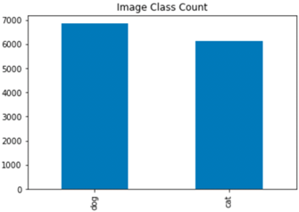
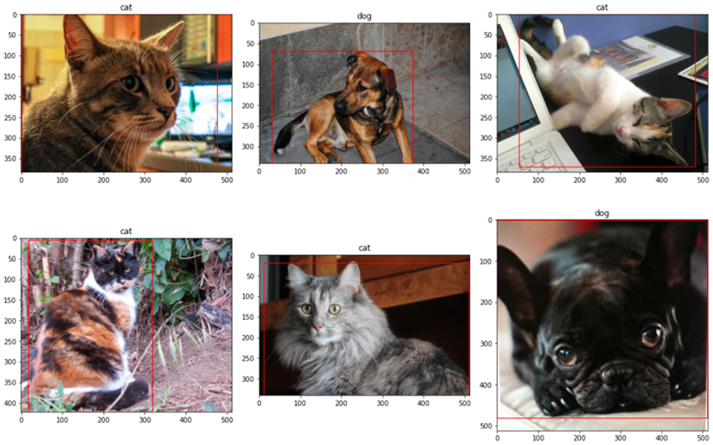
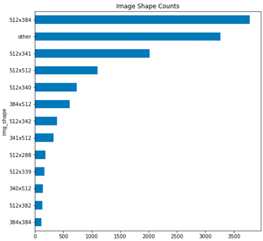
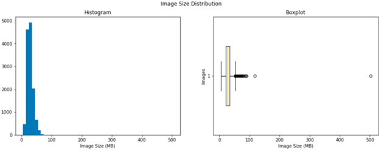
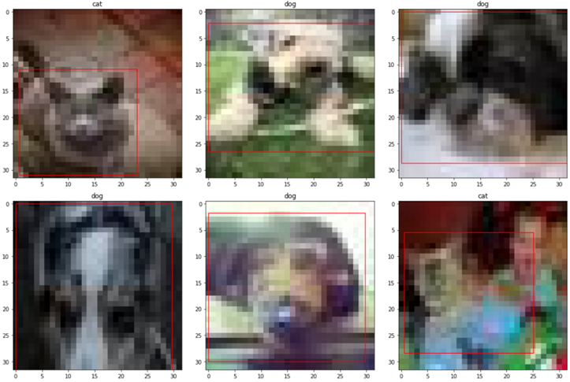
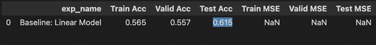
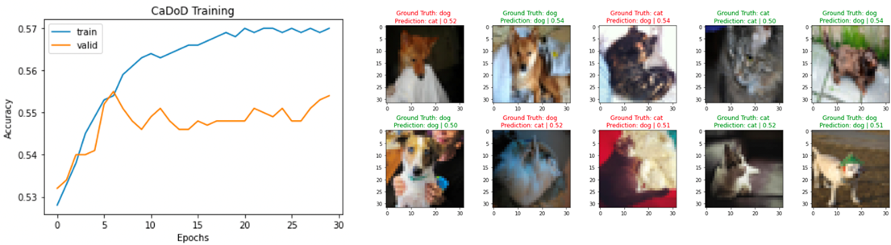
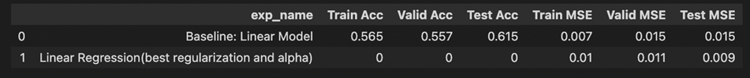
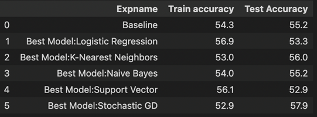

<!-- toc -->

## Table of contents

-   [EDA](#eda)
-   [Sample 6 images with Bounding rectangle (Before)](#sample-6-images-with-bounding-rectangle-before)
    -   [Aspect ratio distribution of Train data set](#aspect-ratio-distribution-of-train-data-set)
    -   [Image size distribution](#image-size-distribution)
    -   [Images after rescaling](#images-after-rescaling)
-   [Baseline - SKLearn](#baseline---sklearn)
-   [Baseline linear regression - LASSO and RIDGE](#baseline-linear-regression---lasso-and-ridge)
-   [Results](#results)
-   [Conclusion](#conclusion)

<!-- tocstop -->

# Phase 1

Our aim for this project is to build object detection pipelines using Python,
OpenCV, SKLearn, and PyTorch to detect cat and dog images. We import the image
catalogue data, perform Exploratory data analysis on it, derive some metrics and
baseline models on the data. In order to create a detector, we will first have
to preprocess the images to be all of the same shapes, take their RGB intensity
values and flatten them from a 3D array to 2D. Then we will feed this array into
a linear classifier and a linear regressor to predict labels and bounding boxes.

- Build an SKLearn model for image classification and a model for regression
- Implement a Homegrown Logistic Regression model. Extend the loss function from
  CXE to CXE + MSE
- Build a baseline pipeline in PyTorch to object classification and object
  localization
- Build a convolutional neural network network for single object classifier and
  detector.

## EDA

We explore our cat and dogs train images by counting the numbers, images
resolutions, shapes, drawing the bounding rectangle around the object in the
image. Then we rescale the images into 32*32 size. This reduces the quality and
size of the image, which brings uniformity and some speed for training.

Below are the findings of EDA done on cats and dogs train data set -

|  | Count |
| --- | --- |
| Dogs | 6,855 |
| Cats | 6,111 |
| Total | 12,966 |

## Sample 6 images with Bounding rectangle (Before)

### Aspect ratio distribution of Train data set

> All other sizes are categorized into `Other`
>

### Image size distribution

### Images after rescaling

## Baseline - SKLearn

<aside>
💡 Linear classification (SGDClassifier) - We perform baseline with SKLearn which yielded a test accuracy of 0.615

</aside> 

## Baseline linear regression - LASSO and RIDGE

<aside>
💡 We performed linear regression and also looked for best alpha using ridge and lasso as estimators. We got best alpha as 0.01.
With LASSO and RIDGE, MSEs for Test and Train improved. Below are the comparison of MSEs with and without regularization.

</aside>> 

We performed grid search to find out the best of logistic regression, KNN, Naive
Bayes, Support Vector, Stochastic GD. Out of all Stochastic GD yielded best Test
accuracy.

## Results

Cats and Dogs Classification is a popular ML problem, which can be solved using
various techniques. We performed algorithms like logistic regression, KNN, Naive
Baye’s, Support Vector, Stochastic Gradient Descent, to find out how well these
algorithms can predict class for the cat and dog image set.

- Among all the models Gradient Descent proved to be better, with accuracy of
  57.9 and the runner up is KNN.
- We have also implemented Baseline linear regression along with Baseline LR
  with Lasso and Ridge(with alpha and best parameters). Lasso and Ridge metrics
  performed better.

## Conclusion

In phase 1, we have focused on the SKLearn Baseline models for logistic
regression, SGDClassifier to classify the images into cats and dogs and Linear
regression for making the bounding boxes around the cats and dogs inside the
image. Well, Test Accuracy alone can’t tell how good an algorithm predicts the
classes in general on various data set. We hope to experiment more by
implementing homegrown logistic regression model and CNN in the next phase.
