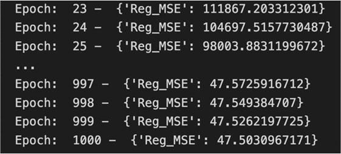
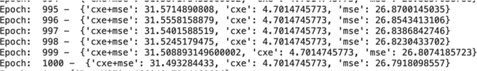

# Phase 2

---

We implemented our own version of linear regression and logistic regression to
compare results during this phase. We also used PyTorch's Sequential and OOP
APIs to implement Multilayer Perceptron Classification/Regression.

<!-- toc -->

## Table of contents

-   [**Linear Regression**](#linear-regression)
    -   [**Initialization:**](#initialization)
    -   [**Fit Model**](#fit-model)
    -   [Results](#results)
-   [**Logistic Regression - CXE + MSE**](#logistic-regression---cxe--mse)
    -   [**Initialization:**](#initialization-1)
    -   [**Fit Model**](#fit-model-1)
    -   [Results](#results-1)
-   [**Multilayer Perceptron Classification/Regression:**](#multilayer-perceptron-classificationregression)
    -   [**Classification:**](#classification)
    -   [**Regression:**](#regression)
    -   [**Multi Head:**](#multi-head)
-   [Results](#results-2)
-   [Conclusion](#conclusion)

<!-- tocstop -->

# **Homegrown Pipeline Implementation**

---

- ***Linear Regression - `MSE loss function from 1 to 4 targets`***
- ***Logistic Regression - `CXE + MSE`***

## **Linear Regression**

### **Initialization:**

- **Random weights**
- **Bias as 1**

### **Fit Model**

- **Define loss function: `RMSE`**
- **Gradient Descent - `Max iteration 1000, learning rate 0.00005`**

### Results

- ***Loss decreases with every epoch***
- ***Validation Accuracy can increase.***

---

## **Logistic Regression - CXE + MSE**

### **Initialization:**

- **Random weights**
- **Bias as 1**

### **Fit Model**

- **Loss function - Add `CXE+MSE loss`**
- **Gradient Descent - *`max iteration 1000, learning rate 0.00005`***

### Results

- ***Loss decreases with every epoch***
- ***Validation Accuracy slightly increases.***

---

## **Multilayer Perceptron Classification/Regression:**

> **Layers - input, hidden(1), output linear layers**

---

### **Classification:**

- **Loss Function: `CrossEntropyLoss`**

### **Regression:**

- **Loss Function : `L1Loss`**

### **Multi Head:**

- **Classification Loss function - `CrossEntropyLoss`**
- **Regression Loss function - `MSELoss`**

## Results

---

**In phase 2, we obtained a class accuracy of 53% using Homegrown logistic and
linear regression, which is not terrible, and 56% using classification with
Multilayer Perceptron, which worked marvelously. The Multi Head API did not
perform well in this classification. We also tried relu and leakyrelu, but
neither worked well. We acquired a loss of 27 in Home grown Linear regression.
Using CXE+MSE and Home grown logistic regression, we found a loss of 31.43.**

## Conclusion

---

We used Homegrown Logistic Regression and Homegrown Linear Regression to compare
the results in this phase. In addition, utilizing PyTorch's Sequential and OOP
APIs, we created MLPs for classification and regression without dropout. The
number of hidden layers, drop out, learning rate, number of epochs, and other
variables were all examined and tabulated.
