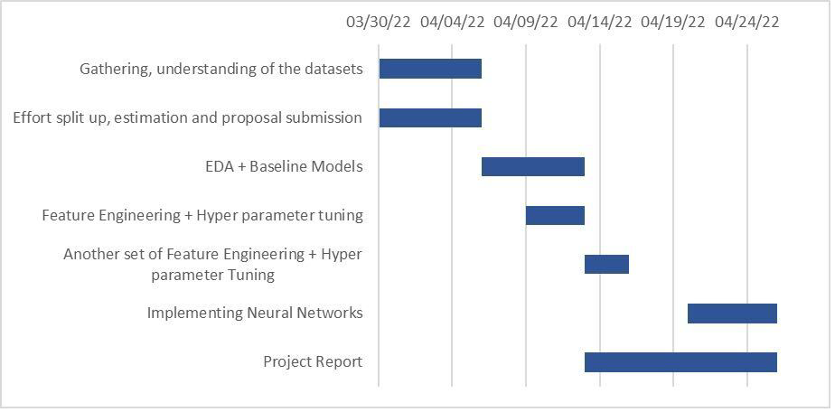

[![Contributors][contributors-shield]][contributors-url]
[![Forks][forks-shield]][forks-url]
[![Stargazers][stars-shield]][stars-url]
[![Issues][issues-shield]][issues-url]
[![MIT License][license-shield]][license-url]
[![LinkedIn][linkedin-shield]][linkedin-url]

[contributors-shield]: https://img.shields.io/github/contributors/kiran-karandikar/Cats-Dog-Classifier?style=for-the-badge
[contributors-url]: https://github.com/Kiran-Karandikar/Cats-Dog-Classifier/graphs/contributors
[forks-shield]: https://img.shields.io/github/forks/Kiran-Karandikar/Cats-Dog-Classifier?style=for-the-badge
[forks-url]: https://github.com/Kiran-Karandikar/Cats-Dog-Classifier/network
[stars-shield]: https://img.shields.io/github/stars/Kiran-Karandikar/Cats-Dog-Classifier?style=for-the-badge
[stars-url]: https://github.com/Kiran-Karandikar/Cats-Dog-Classifier/stargazers
[issues-shield]: https://img.shields.io/github/issues/Kiran-Karandikar/Cats-Dog-Classifier?style=for-the-badge
[issues-url]: https://github.com/Kiran-Karandikar/Cats-Dog-Classifier/issues
[license-shield]: https://img.shields.io/github/license/Kiran-Karandikar/Cats-Dog-Classifier?style=for-the-badge
[license-url]: https://github.com/Kiran-Karandikar/Cats-Dog-Classifier/blob/master/LICENSE
[linkedin-shield]: https://img.shields.io/badge/-LinkedIn-black.svg?style=for-the-badge&logo=linkedin&colorB=555
[linkedin-url]: https://linkedin.com/in/kiran-karandikar

---

<!-- PROJECT LOGO -->
 

<h3 align="center">Cats-Dog-Classifier</h3>
  

    Create an algorithm to distinguish dogs from cats    
         
    <a href="https://kiran-karandikar.github.io/Cats-Dog-Classifier"><strong>Preview</strong></a>
     
    <a href="https://github.com/kiran-karandikar/Cats-Dog-Classifier"><strong>Explore the docs »</strong></a>
     
     
    <a href="https://github.com/kiran-karandikar/Cats-Dog-Classifier">View Demo</a>
    ·
    <a href="https://github.com/kiran-karandikar/Cats-Dog-Classifier/issues">Report Bug</a>
    ·
    <a href="https://github.com/kiran-karandikar/Cats-Dog-Classifier/issues">Request Feature</a>
  

<!-- BADGES.MD Finish -->
<!-- BADGES.MD Finish -->

<!-- toc -->

## Table of contents

-   [About The Project](#about-the-project)
-   [Background on the dataset](#background-on-the-dataset)
    -   [Built With](#built-with)
    -   [Extras](#extras)
        -   [Project Timeline:](#project-timeline)
-   [License](#license)
-   [Contact](#contact)

<!-- tocstop -->

<!-- ABOUT THE PROJECT -->

## About The Project

The main motto of this data set is to process the images of cats and dogs and predict their labels as cat or dog using few machine learning functional metrics (RMSE and MSE).

For humans it is easy to tell whether it is a cat or dog, but for a machine it is difficult to predict.

Cats’ vs dogs object detection is one of the projects which can be done under computer vision. We will classify the images to predict whether it is cat or dog. For this object classification and detection, we will be using convolution Neural Network (CNN). We will use logistic regression and stochastic gradient descent to classify the images. We will be using SKLearn’s and Pytorch models to implement all the above functionalities.

## Background on the dataset

This data set was firstly used in a Kaggle competition held in 2013. There are about 13,000 images of varying shapes and aspect ratios. They are all RGB pictures and have bounding box organizes put away in a `.csv` record.

(<a href="#top">back to top</a>)

### Built With

* [Jupyter Notebook](http://jupyter.org/) - Project Jupiter exists to develop
  open-source software, open standards, and services for interactive computing
  across dozens of programming languages.
* [scikit-learn](http://scikit-learn.org/stable/) - Machine Learning in Python.
* [Pandas](https://pandas.pydata.org/) - pandas is an open-source, BSD-licensed
  library providing high-performance, easy-to-use data structures, and data
  analysis tools for the Python programming language.
* [Google Collab](https://colab.research.google.com) - a free Jupiter notebook
  environment that runs entirely in the cloud.

(<a href="#top">back to top</a>)

### Extras

> Designed with passion as part of the curriculum for the course CSCI-P 556 -
Applied Machine Learning in the spring of 2022 in four phases.

#### Project Timeline:

<!-- LICENSE -->

## License

Distributed under the `MIT License`. See [LICENSE](LICENSE) file for more information.

(<a href="#top">back to top</a>)

### Other projects

Check out the other stuff I've worked upon.

- **_AI/ML/Data Science_**

  - **AML-Home-Credit-Default-Risk** : [Predicting how capable each applicant is of repaying a loan \(Kaggle Challenge\).](https://github.com/Kiran-Karandikar/AML-Home-Credit-Default-Risk)

  - **Exercise-performance-analysis** : [Prototype exercise volume prediction using machine learning models.](https://github.com/Kiran-Karandikar/Exercise-performance-analysis)

- **_Web Development_**

  - **flask-app-template** : [Simple, reusable, minimalistic, configurable flask app.](https://github.com/Kiran-Karandikar/flask-app-template)

  - **flask-oauth2-wrike-api** : [A sample Flask app to authenticate with Wrike as a third-party OAuth2 provider.](https://github.com/Kiran-Karandikar/flask-oauth2-wrike-api)

> Section `Other projects` is auto-updated using [Github actions](https://github.com/features/actions).

<!-- CONTACT -->

## Contact

- [Kiran Karandikar:](mailto:connect.funnel.github@kirankarandikar.com)

